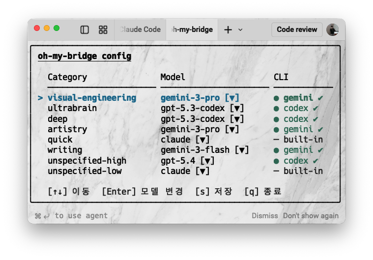

<div align="center">

# oh-my-bridge

**각 모델의 강점을 라우팅한다.**

Claude Code에서 작업을 분류하고, 적합한 모델에 위임하는 브리지 MCP 서버.

[](https://github.com/Bongseop-Kim/oh-my-bridge/releases)
[](./LICENSE)


</div>

---

Claude Code 하나에만 종속될 필요가 없다. Codex는 로직에 강하고,
Gemini는 UI를 잘 만들고, Claude는 판단을 잘한다. oh-my-bridge는
작업을 카테고리로 분류하고, 미리 정해진 라우트에 따라 적합한 모델에 위임한다.

**Claude가 판단하고, 최적의 모델이 생성한다.**

---

## 어떻게 동작하는가

```text
사용자 요청
  → [code-routing] 결과에 실행 가능한 로직이 포함되는가?
      → YES: 카테고리 분류 → config 라우트로 단일 모델 선택
          → route === "claude" 또는 CLI 미설치 → Claude 직접 처리
          → 그 외 → MCP 호출 → 결과 검증 → 사용자 보고
      → NO: Claude 네이티브 Edit/Write 직접 사용
```

카테고리가 정해지면 모델은 config가 결정한다. Claude가 개입하지 않는다.

`code-routing` Skill 하나가 이 흐름을 제어한다.

| 섹션          | 역할           | 결정                                                             |
| ------------- | -------------- | ---------------------------------------------------------------- |
| Routing rule  | 위임 여부 판단 | "결과에 실행 가능한 로직이 포함되는가?" → delegate / direct      |
| Model Routing | 모델 선택      | 카테고리 분류 → config 라우트에서 단일 모델 결정 (fallback 없음) |

설계 결정의 근거: [docs/architecture.md](docs/architecture.md)

---

## 언제 위임하는가

| 위임 (외부 모델)                                              | 직접 처리 (Claude)                                                                                 |
| ------------------------------------------------------------- | -------------------------------------------------------------------------------------------------- |
| 새 파일/함수/클래스, 리팩토링, 보일러플레이트, 기존 로직 수정 | 오타/주석 수정, 설정값, Markdown 편집, Tailwind className, 자동생성 파일, lock 파일, 환경변수 추가 |

> 판단이 애매하면 위임한다.

---

## 카테고리별 모델 라우팅

작업을 분류하면 `~/.config/oh-my-bridge/config.json`의 라우트 설정에서 단일 모델이 결정된다. 자동 전환(fallback)은 없다.

| 카테고리             | 적용 작업                 | 기본 모델          |
| -------------------- | ------------------------- | ------------------ |
| `visual-engineering` | UI, CSS, SVG, 레이아웃    | gemini-3-pro-preview    |
| `ultrabrain`         | 알고리즘, 복잡한 아키텍처 | gpt-5.3-codex           |
| `deep`               | 리팩토링, 복잡한 로직     | gpt-5.3-codex           |
| `artistry`           | 창의적 패턴, 코드 스타일  | gemini-3-pro-preview    |
| `quick`              | 보일러플레이트, 단순 함수 | Claude (직접 처리)      |
| `writing`            | 문서, 주석, README        | gemini-3-flash-preview  |
| `unspecified-high`   | 판단 어렵고 중요도 높음   | gpt-5.4            |
| `unspecified-low`    | 판단 어렵고 중요도 낮음   | Claude (직접 처리) |

> **참고:** `route === "claude"`이거나 해당 CLI가 설치되지 않은 경우 `action: "claude"`로 응답하며 Claude가 직접 처리한다.

---

## 모델 라인업

| 모델             | 성격             | 강점                                           |
| ---------------- | ---------------- | ---------------------------------------------- |
| **Claude**       | Mechanics-driven | 오케스트레이션, 간단한 편집                    |
| **Codex (GPT)**  | Principle-driven | 로직 중심 코드, 리팩토링, 복잡한 비즈니스 로직 |
| **Gemini Pro**   | Vision-driven    | UI/UX, 비주얼 컴포넌트, 디자인 시스템          |
| **Gemini Flash** | Speed-driven     | 문서, 보일러플레이트, 빠른 처리                |
| **GPT-5.4**      | Balanced         | 카테고리 불분명한 고임팩트 작업                |

MCP 서버는 Go 정적 바이너리 하나(`bridge`)로 위의 모든 외부 모델을 커버한다. `config.json`의 라우트만 바꾸면 즉시 반영된다.

---

## 설치

### 전제 조건

```bash
npm install -g @openai/codex      # Codex CLI
npm install -g @google/gemini-cli # Gemini CLI

codex --version   # 설치 확인
gemini --version
```

### 원라인 설치

```bash
curl -sSL https://raw.githubusercontent.com/Bongseop-Kim/oh-my-bridge/main/install.sh | bash
```

한 번에 처리됨:

1. 최신 바이너리 다운로드 → `~/.local/bin/oh-my-bridge`
2. `claude mcp add bridge --scope user` — MCP 서버 등록
3. `oh-my-bridge install-skills` — Skill, hook, config 설치

Claude Code를 재시작하면 `code-routing` Skill이 자동 적용된다.

> `~/.local/bin`이 PATH에 없는 경우 설치 후 안내 메시지가 출력된다:
> `export PATH="$HOME/.local/bin:$PATH"` 를 쉘 프로파일에 추가한다.

---

## 검증

### MCP 연결

```bash
claude mcp list          # bridge 항목 확인
```

또는 Claude Code 내에서:

```text
/mcp
```

`bridge · ✔ connected` 확인.

### Skill 설치

```bash
head -3 ~/.claude/skills/oh-my-bridge/SKILL.md
# name: oh-my-bridge:code-routing
```

### E2E 테스트

**코드 생성 — MCP 위임 확인:**

```text
Express.js REST API 엔드포인트 구현해줘
```

1. Claude가 카테고리를 `deep` 또는 `unspecified-high`로 분류
2. `mcp__bridge__delegate` 호출 (model은 config 라우트가 결정)
3. 응답에 `category`, `model used` 포함

**단순 편집 — 직접 처리 확인:**

```text
README.md 오타 수정해줘
```

Claude가 Edit 직접 사용. MCP 미호출.

---

## Config 편집

`~/.config/oh-my-bridge/config.json`의 라우트를 터미널에서 직접 수정할 수 있다.

```bash
oh-my-bridge --version   # 바이너리 버전 출력
oh-my-bridge doctor      # 전체 환경 진단
oh-my-bridge stats       # 모델별 사용 통계

# 인터랙티브 TUI 에디터 (기본)
oh-my-bridge config

# 현재 설정 테이블 출력
oh-my-bridge config list

# 설정 유효성 검사
oh-my-bridge config validate
```

### TUI 에디터 조작법

| 화면 | 키 | 동작 |
| ---- | --- | ---- |
| 목록 | `↑` / `↓` 또는 `k` / `j` | 카테고리 이동 |
| 목록 | `Enter` | 모델 드롭다운 열기 |
| 목록 | `s` | 변경사항 diff 미리보기 후 저장 |
| 목록 | `q` / `Ctrl+C` | 종료 (미저장 시 확인) |
| 드롭다운 | `↑` / `↓` | 모델 선택 |
| 드롭다운 | `Enter` | 선택 확정 |
| 드롭다운 | `Esc` | 취소 |
| Diff | `Enter` | 저장 |
| Diff | `Esc` | 취소 |

각 카테고리 옆에 **CLI 상태** (`● codex ✔` / `✗ codex 없음` / `─ built-in`)가 표시되어 설치 여부를 즉시 확인할 수 있다. 저장은 atomic write(`.tmp` → rename)로 처리된다.



---

## 업데이트

설치 명령을 다시 실행하면 된다. 이미 최신 버전이면 아무 작업도 하지 않는다.

```bash
curl -sSL https://raw.githubusercontent.com/Bongseop-Kim/oh-my-bridge/main/install.sh | bash
```

바이너리, MCP 등록, Skills, config 모두 멱등적으로 갱신된다.

---

## 로그

```bash
# 사용 통계 (모델별 호출 수 · 평균 응답 시간)
oh-my-bridge stats

# 최근 5건
tail -5 ~/.claude/logs/oh-my-bridge.log | jq .

# 에러만
jq 'select(.status == "error")' ~/.claude/logs/oh-my-bridge.log

# 오늘 사용량
jq 'select(.timestamp | startswith("'"$(date -u +%Y-%m-%d)"'"))' ~/.claude/logs/oh-my-bridge.log
```

### stats 출력 예시

```text
oh-my-bridge stats

모델별 호출 수  (오늘 / 전체)
─────────────────────────────────────────
gpt-5.3-codex           12 / 87    평균 응답 23.4s
gemini-3-pro-preview     5 / 41    평균 응답 11.2s
claude (direct)          8 / 63    —
─────────────────────────────────────────
총 위임                    17 / 128
```

---

## 진단

### 버전 확인

```bash
oh-my-bridge --version
```

### 전체 환경 진단

```bash
oh-my-bridge doctor
```

```text
oh-my-bridge doctor
───────────────────────────────────────
binary       v2.4.0     ✔
config       ok         ✔  (~/.config/oh-my-bridge/config.json)
skill        installed  ✔
codex        found      ✔  (/usr/local/bin/codex)
gemini       found      ✔  (/usr/local/bin/gemini)
───────────────────────────────────────
✔ all checks passed
```

---

## 디렉토리 구조

```text
oh-my-bridge/
├── install.sh               원라인 설치 스크립트
├── uninstall.sh             제거 스크립트 (--all 플래그로 완전 제거)
├── .claude-plugin/          플러그인 메타데이터 (기존 사용자 호환용)
│   ├── marketplace.json
│   └── plugin.json
├── .goreleaser.yml          GoReleaser 릴리즈 자동화
├── .github/workflows/
│   └── release.yml         태그 push 시 바이너리 빌드 + 배포
├── mcp-servers/
│   └── bridge/             Go MCP 서버 (정적 바이너리)
│       ├── main.go
│       ├── setup_cmd.go    install-skills 서브커맨드
│       ├── state.go        loadConfig (config 없으면 자동 생성)
│       ├── go.mod
│       └── go.sum
├── commands/
│   └── status.md           /oh-my-bridge:status
├── skills/
│   └── code-routing.md     위임 여부 판단 + 카테고리 분류 + config 라우트 기반 단일 모델 선택
└── bump-version.sh
```

---

## 개발

```bash
# 로컬 바이너리 빌드 (Go 필요)
make build   # embed + go build

# 테스트
make test

# 버전 업데이트 + 릴리즈
./bump-version.sh <new-version>
# 자동으로: types.go + plugin.json + marketplace.json + CLAUDE.md 버전 갱신
# commit + tag → main 머지 후 태그 push하면 GitHub Actions가 릴리즈 생성

# 재배포 순서
# 1. ./bump-version.sh <version>   ← commit + local tag 자동 포함
# 2. git push origin <branch> → PR → main 머지
# 3. git push origin v<version>    ← GitHub Actions 트리거
# 4. (2분 대기) GitHub Actions 릴리즈 완료 대기
# 5. curl -sSL https://raw.githubusercontent.com/Bongseop-Kim/oh-my-bridge/main/install.sh | bash
# 6. Claude Code 재시작
```

---

## 제거

```bash
# Skills + hooks + MCP 제거 (바이너리·config 유지)
bash <(curl -sSL https://raw.githubusercontent.com/Bongseop-Kim/oh-my-bridge/main/uninstall.sh)

# 완전 제거 (바이너리 + config 포함)
bash <(curl -sSL https://raw.githubusercontent.com/Bongseop-Kim/oh-my-bridge/main/uninstall.sh) --all
```

제거 후 Claude Code를 재시작하면 비활성화된다.
